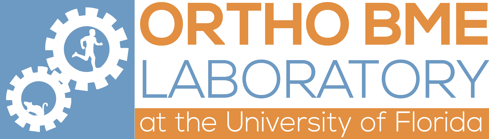
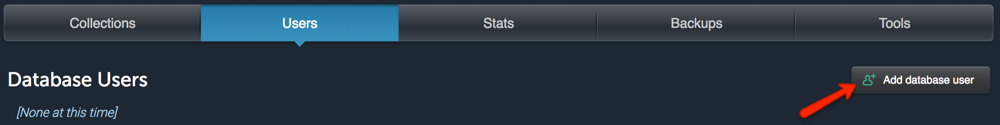
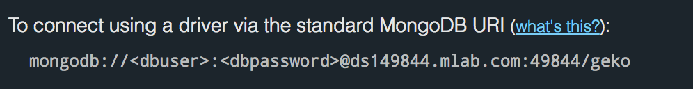
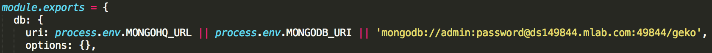

# GUI for the Evaluation of Knee Osteoarthritis (GEKO) Image Grader
This is a project that has been done on behalf of [Dr. Kyle D. Allen](https://www.bme.ufl.edu/people/allen_kyle) and his [Orthopedic Biomedical Engineering Lab](http://bme.ufl.edu/labs/allen/). This web application was build by University of Florida students for CEN3031, Introduction to Software Engineering, under the instruction of Dr. Christine Gardner-McCune. Check out the site live at http://ec2-18-221-26-209.us-east-2.compute.amazonaws.com:3000/!

The software development teams consists of:
* Erol Bahadiroglu: Development Team
* Yilu Bao: Product Manager
* Caleb Bryant: Scrum Master
* Christoph Porwol: Development Team
* Caleb Robey: Development Team
* Andre Williams: Development Team

## Contributing
We welcome pull requests from the community! Just be sure to read the [contributing](/CONTRIBUTING.md) doc to get started.

## Database Connection of Local Copy
To use the website offline, the git repository can be cloned and connected to a MongoDB account from your computer. To make a new account visit [mlab.com](https://mlab.com/) and follow the account creation steps. After the account has been created, login and instantiate a new database (choose provider that is closest to your physical location).

**Follow these steps to connect the local copy to your database:**
1. In the mlab.com home menu, click on the database link

2. Create a new user to access the database

3. Locate the link to your database at the beginning of the page

4. Open [config/env/development.js](config/env/development.js) in your local repository copy and replace the following line with the link from the previous step. Make sure dbuser and dbpassword are equivalent to the user credentials of step 2.

## Credits
* Thank you to Dr. Allen for giving us the opportunity to work on this project!
